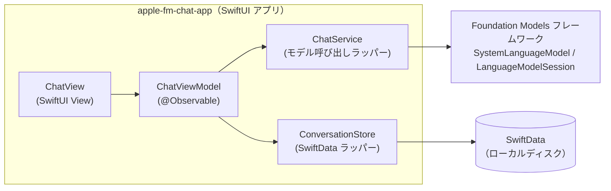
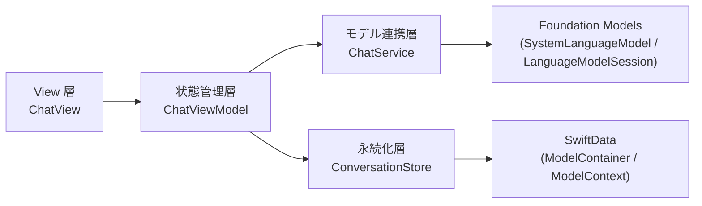

# アーキテクチャ

## 全体構成図

- アプリは単一プロセス・単一ウィンドウの macOS アプリ。外部サーバーとの通信は行わない。
- モデルは Foundation Models フレームワークを通じて OS が提供する端末内モデルを使う。
- 会話は SwiftData を使いローカルディスクへ永続化する。外部（iCloud 等）への同期は行わない。

## 技術選定と理由（ADR）

### ADR-001: Swift + SwiftUI を採用する

- 決定: 実装言語に Swift、UI に SwiftUI を使う。
- 背景: macOS 向けの 1 画面アプリを最小構成で作る要件があり、ユーザーからも指定されている。
- 却下した選択肢: AppKit（UIKit 的な命令的 UI）— SwiftUI に比べ最小構成での実装コストが高く、今回の要件に対して過剰。
- トレードオフ: 特になし（要件・規模の両面で SwiftUI が妥当）。

### ADR-002: AI 機能に Foundation Models フレームワーク（端末内モデル）を使う

- 決定: `SystemLanguageModel` / `LanguageModelSession`（Foundation Models フレームワーク）を使い、Apple Intelligence の端末内モデルのみで応答を生成する。
- 背景: オフラインで完結する動作確認用アプリが目的であり、ユーザー環境で `fm chat`（ターミナル）による端末内モデルとの会話が確認済みだった。
- 却下した選択肢: Private Cloud Compute、他社 LLM API — 今回はスコープ外（requirements.md のスコープ外を参照）。
- トレードオフ: 端末内モデルの性能・コンテキストサイズの制約を受ける（`contextSize` は固定値ではなく OS バージョンにより変わり得る。2026-09 時点の公式ドキュメントでは 4096 トークン/セッションと案内されている）。ハードコードせず `SystemLanguageModel.default.contextSize` を都度参照する。

### ADR-003: 画面表示とモデル呼び出しをファイル・クラスで分離する

- 決定: SwiftUI の View（表示）と、モデルとのやり取り（ChatViewModel / ChatService）を別ファイル・別クラスに分ける。
- 背景: ユーザー方針。保守性と SwiftUI プレビューでの見た目確認のしやすさを両立させるため。
- 却下した選択肢: View 内に `LanguageModelSession` を直接保持する単一ファイル構成 — 最小実装としては書けるが、プレビュー時にモデル呼び出しが絡み検証しづらく、要件の方針にも反する。
- トレードオフ: ファイル数がわずかに増える（今回の規模では無視できる）。

### ADR-004: 会話の永続化に SwiftData を使い、Foundation Models の `Transcript` をそのまま保存する

- 決定: 会話の永続化に SwiftData を使う。保存するデータは、画面表示用に独自定義したメッセージ構造体ではなく、Foundation Models の `Transcript`（`Codable` 準拠）をエンコードしたバイナリとする。アプリ起動時はこれをデコードして `LanguageModelSession(transcript:)` に渡し、セッションを復元する。
- 背景: ユーザー指示によりスコープイン。`Transcript` は公式ドキュメント上 `Codable` に準拠していることを確認済みであり、指示・プロンプト・応答をこちらで再現する独自スキーマを持つより、フレームワークが提供する表現をそのまま永続化する方が変換ロジックを持たずに済み、モデルとのやり取りの忠実な再現につながる。
- 却下した選択肢:
  - `UserDefaults` — 会話が長くなるとサイズ・性能の面で不向き。
  - 画面表示用の独自メッセージ配列のみを保存し、起動時にプレーンテキストとして再度プロンプトに詰め直す方式 — 指示（Instructions）やツール呼び出し等の構造情報を失い、`Transcript` が本来持つ再現性を活かせない。
- トレードオフ: `Transcript` のシリアライズ形式は Foundation Models フレームワーク側の内部表現に依存する。OS ・モデルのバージョンが上がった際に、保存済みデータのデコードやセッション復元に失敗する可能性がある（Apple 公式ドキュメントで明示的な後方互換保証は確認できていない、TBD）。失敗した場合は保存データを破棄し、空の会話から始める形でリカバリする方針とする。

## レイヤー構成と依存の方向

- 依存は View → 状態管理層 → （モデル連携層・永続化層） → フレームワーク の一方向のみ。逆方向の依存（フレームワークや ChatService / ConversationStore が View / ViewModel を知る）は作らない。
- モデル連携層（ChatService）と永続化層（ConversationStore）は互いに依存しない。両者の橋渡しは状態管理層（ChatViewModel）が行うが、ChatViewModel は `Data` のみを受け渡し、`Transcript` の中身には関与しない（次項）。
- `Transcript` 型（Foundation Models）に触れるのは ChatService のみとする。ConversationStore は `Transcript` を知らず、SwiftData に保存する対象を「エンコード済みの `Data`」としてのみ扱う。View・ViewModel はどちらの型も扱わない。

## 不変条件・境界

- View 層・ViewModel 層は Foundation Models フレームワークの型（`LanguageModelSession` / `SystemLanguageModel` / `Transcript` など）および SwiftData の型（`ModelContext` 等）を直接 import・参照しない。ViewModel が ChatService と ConversationStore の間で受け渡すのは `Data`（エンコード済みバイト列）のみ。
- アプリはネットワーク通信を行わない（Private Cloud Compute・外部 API への送信は存在しない）。SwiftData の永続化もローカルディスクのみで、iCloud 等への同期は行わない。
- 永続化される会話は常に 0 件または 1 件で、複数会話を一覧管理する状態は作らない。
- コンテキストサイズ超過（`LanguageModelError.contextSizeExceeded`）によってアプリがクラッシュ状態・操作不能状態で停止することはない。ただし自動では継続しない。利用者に新しい会話の開始を促す UI を表示し、利用者が「新しい会話」を操作したときにのみ新しいセッションへ切り替える。
- 応答生成中（ストリーミング中）に「新しい会話」が操作された場合、進行中のストリーミング `Task` を必ずキャンセルしてから新しいセッションを生成する。キャンセル前の部分テキストが新しいセッションの表示に混入することはない。
- コンテキストサイズの上限値をコード中に数値としてハードコードしない。常に `SystemLanguageModel` が提供する値（`contextSize` 等）を参照する。
- 保存済みデータのデコード・セッション復元に失敗しても、アプリの起動自体が失敗することはない。失敗時は保存データを破棄し、空の会話から起動を続ける。

## 共通規約

- コメントは日本語で、要点のみ短く書く（Foundation Models 側の書き方が macOS 27 で変わっている可能性があるため、参照した挙動・注意点はコードコメントで簡潔に残す）。
- 作業は小さな単位に区切り、区切りごとに変更内容を説明する。

## 非機能の実現方式

- オンデバイス処理・オフライン動作: Foundation Models フレームワークの端末内モデルのみを使用することで満たす（ADR-002）。
- 会話の永続化: SwiftData を使いローカルディスクへ保存する（ADR-004）。`transcriptData` は会話が進むほど肥大化しうるため、`@Attribute(.externalStorage)` を付与し、SQLite 本体とは別領域に保存する。
- テスト方針: TBD。ユーザーからは「ビルドが通ることの確認」と「SwiftUI プレビューでの見た目確認」のみ指示があり、自動テスト（Unit Test / UI Test）の要否・範囲は未確定。
