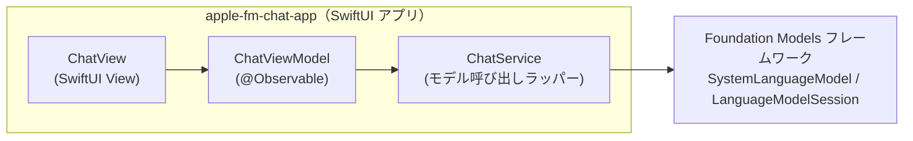
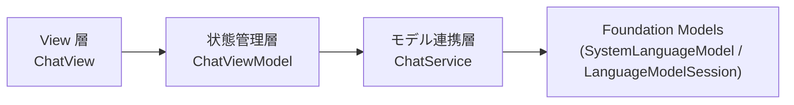

# アーキテクチャ

## 全体構成図

- アプリは単一プロセス・単一ウィンドウの macOS アプリ。外部サーバーとの通信は行わない。
- モデルは Foundation Models フレームワークを通じて OS が提供する端末内モデルを使う。

## 技術選定と理由（ADR）

### ADR-001: Swift + SwiftUI を採用する

- 決定: 実装言語に Swift、UI に SwiftUI を使う。
- 背景: macOS 向けの 1 画面アプリを最小構成で作る要件があり、ユーザーからも指定されている。
- 却下した選択肢: AppKit（UIKit 的な命令的 UI）— SwiftUI に比べ最小構成での実装コストが高く、今回の要件に対して過剰。
- トレードオフ: 特になし（要件・規模の両面で SwiftUI が妥当）。

### ADR-002: AI 機能に Foundation Models フレームワーク（端末内モデル）を使う

- 決定: `SystemLanguageModel` / `LanguageModelSession`（Foundation Models フレームワーク）を使い、Apple Intelligence の端末内モデルのみで応答を生成する。
- 背景: オフラインで完結する動作確認用アプリが目的であり、ユーザー環境で `fm chat`（ターミナル）による端末内モデルとの会話が確認済みだった。
- 却下した選択肢: Private Cloud Compute、他社 LLM API — 今回はスコープ外（requirements.md のスコープ外を参照）。
- トレードオフ: 端末内モデルの性能・コンテキストサイズの制約を受ける（`contextSize` は固定値ではなく OS バージョンにより変わり得る。2026-09 時点の公式ドキュメントでは 4096 トークン/セッションと案内されている）。ハードコードせず `SystemLanguageModel.default.contextSize` を都度参照する。

### ADR-003: 画面表示とモデル呼び出しをファイル・クラスで分離する

- 決定: SwiftUI の View（表示）と、モデルとのやり取り（ChatViewModel / ChatService）を別ファイル・別クラスに分ける。
- 背景: ユーザー方針。保守性と SwiftUI プレビューでの見た目確認のしやすさを両立させるため。
- 却下した選択肢: View 内に `LanguageModelSession` を直接保持する単一ファイル構成 — 最小実装としては書けるが、プレビュー時にモデル呼び出しが絡み検証しづらく、要件の方針にも反する。
- トレードオフ: ファイル数がわずかに増える（今回の規模では無視できる）。

## レイヤー構成と依存の方向

- 依存は View → 状態管理層 → モデル連携層 → フレームワーク の一方向のみ。逆方向の依存（フレームワークや ChatService が View / ViewModel を知る）は作らない。
- View は `LanguageModelSession` や `Transcript` などフレームワークの型を直接扱わない。フレームワークの型に触れるのは ChatService のみとする。

## 不変条件・境界

- View 層は Foundation Models フレームワークの型（`LanguageModelSession` / `SystemLanguageModel` / `Transcript` など）を直接 import・参照しない。
- アプリはネットワーク通信を行わない（Private Cloud Compute・外部 API への送信は存在しない）。
- 会話内容はメモリ上にのみ存在し、ディスクや `UserDefaults` 等への永続化は行わない。
- コンテキストサイズ超過（`LanguageModelError.contextSizeExceeded`）によってアプリがクラッシュ状態・操作不能状態で停止することはない。必ず新しいセッションを生成して操作可能な状態に戻す。
- コンテキストサイズの上限値をコード中に数値としてハードコードしない。常に `SystemLanguageModel` が提供する値（`contextSize` 等）を参照する。

## 共通規約

- コメントは日本語で、要点のみ短く書く（Foundation Models 側の書き方が macOS 27 で変わっている可能性があるため、参照した挙動・注意点はコードコメントで簡潔に残す）。
- 作業は小さな単位に区切り、区切りごとに変更内容を説明する。

## 非機能の実現方式

- オンデバイス処理・オフライン動作: Foundation Models フレームワークの端末内モデルのみを使用することで満たす（ADR-002）。
- テスト方針: TBD。ユーザーからは「ビルドが通ることの確認」と「SwiftUI プレビューでの見た目確認」のみ指示があり、自動テスト（Unit Test / UI Test）の要否・範囲は未確定。
