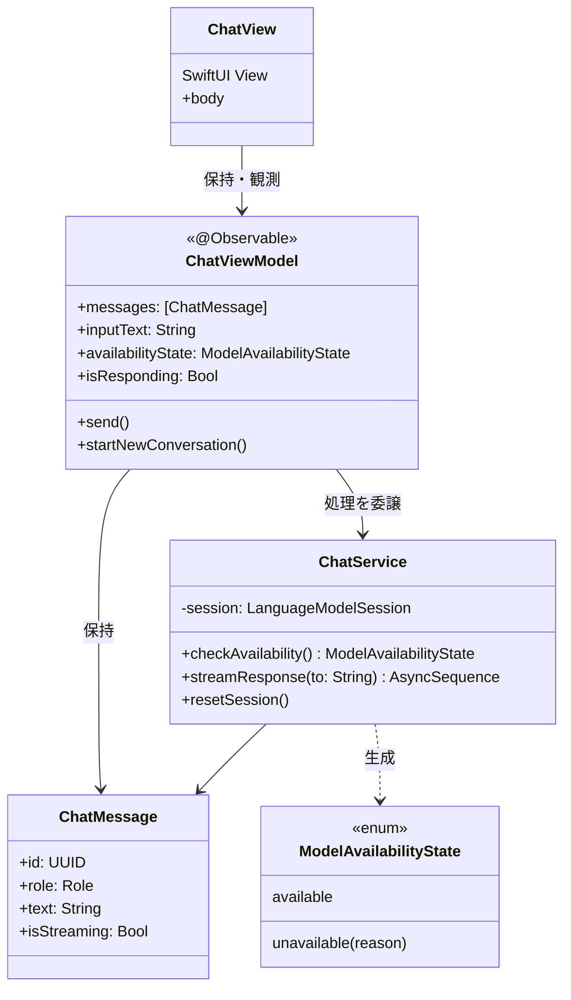
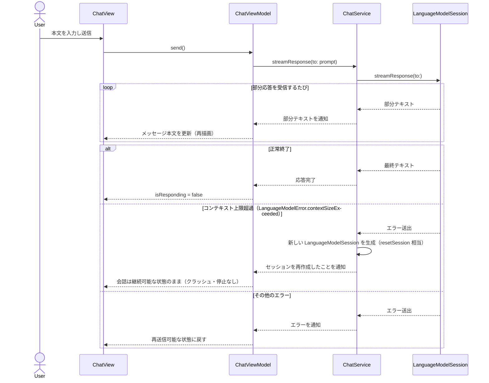
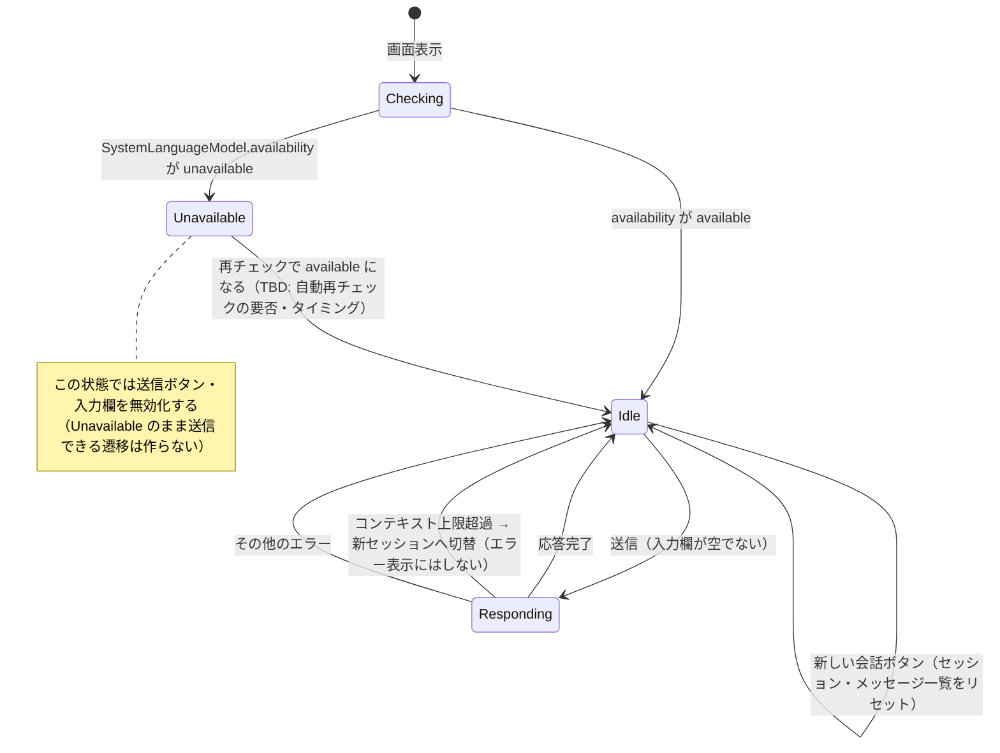

# 詳細設計

## モジュール・クラス構成

- `ChatView`: SwiftUI の View。メッセージ一覧・入力欄・送信ボタン・新しい会話ボタン・利用不可バナーの表示のみを担当する。Foundation Models の型を直接扱わない。
- `ChatViewModel`: 画面の状態（メッセージ配列、入力文字列、応答中フラグ、利用可否）を保持し、`ChatView` から呼ばれる操作を `ChatService` に委譲する。
- `ChatService`: `LanguageModelSession` / `SystemLanguageModel` をラップし、フレームワーク固有の型・エラーをこの層に閉じ込める。View・ViewModel からはフレームワークの型が見えない。
- `ChatMessage`: 画面表示用のメッセージデータ。永続化はしない。

## 主要な処理の流れ

最もリスクが高い「送信〜ストリーミング表示〜コンテキスト上限到達時のリカバリ」を中心に記載する。

- コンテキスト上限超過時に前の文脈をどこまで新セッションへ引き継ぐか（先頭・末尾の `Transcript.Entry` を種にするか、何も引き継がず空の状態から始めるか）は TBD。要件上は「新しいセッションで会話を続けられる」ことが必須で、引き継ぎの精度は問わない。

## 状態遷移

`ChatViewModel` が持つ「モデル利用可否」と「応答生成」の状態遷移。起きてはいけない遷移（利用不可のまま送信できてしまう等）を明示する。

## データアクセス設計

永続化を行わないため、データアクセス層は存在しない。`ChatViewModel` が保持する `[ChatMessage]` 配列と `ChatService` が保持する `LanguageModelSession` は、いずれもアプリプロセスのメモリ上にのみ存在し、アプリ終了・「新しい会話」操作のいずれかで破棄される。
