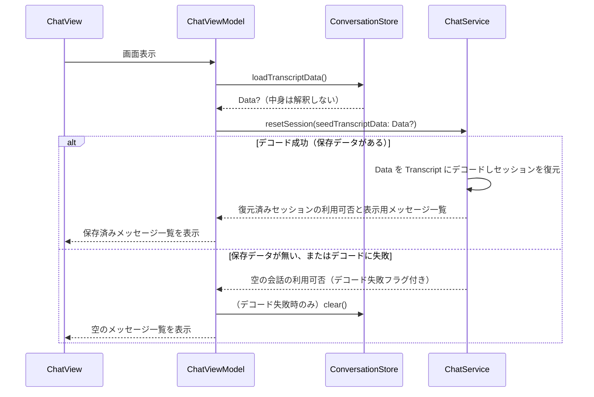
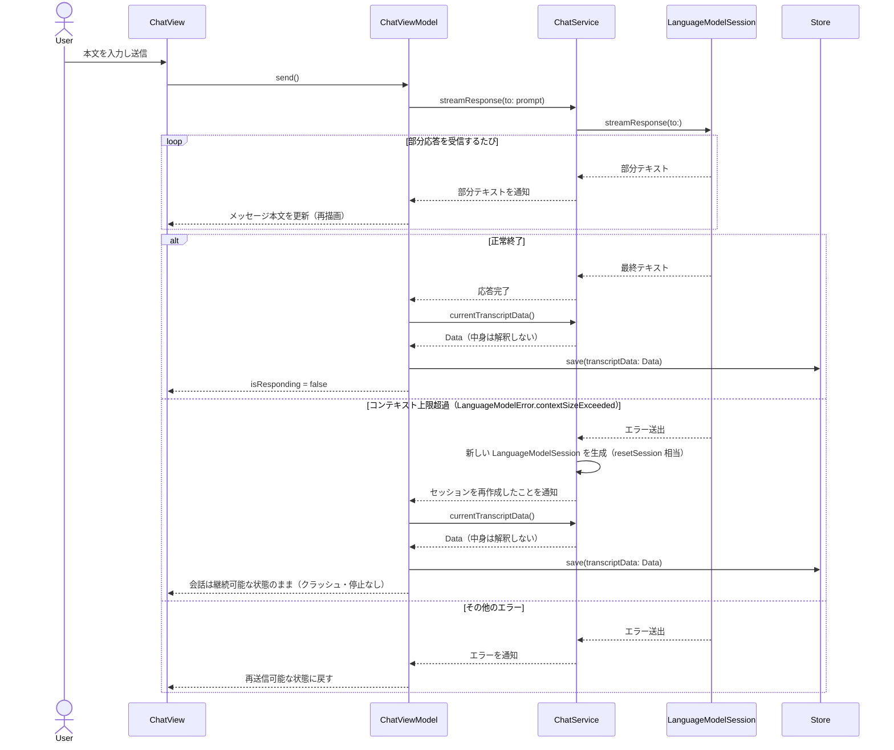
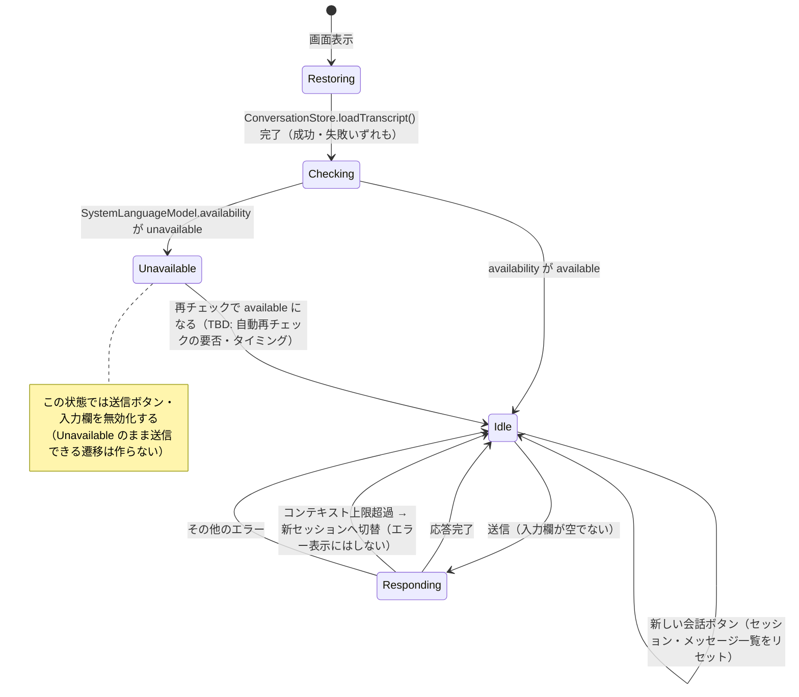

# 詳細設計

## モジュール・クラス構成

- `ChatView`: SwiftUI の View。メッセージ一覧・入力欄・送信ボタン・新しい会話ボタン・利用不可バナーの表示のみを担当する。Foundation Models・SwiftData いずれの型も直接扱わない。
- `ChatViewModel`: 画面の状態（メッセージ配列、入力文字列、応答中フラグ、利用可否）を保持し、`ChatView` から呼ばれる操作を `ChatService`（モデル呼び出し）と `ConversationStore`（永続化）に委譲する。両者を橋渡しする役割を持つ。
- `ChatService`: `LanguageModelSession` / `SystemLanguageModel` / `Transcript` をラップし、フレームワーク固有の型・エラーをこの層に閉じ込める。`Transcript` のエンコード・デコードも ChatService の責務とし、外部には `Data` としてのみ公開する。`resetSession` は起動時の復元・コンテキスト超過時のいずれからも呼ばれ、引き継ぐデータを省略すると空の会話から始める。
- `ConversationStore`: SwiftData（`ModelContext`）をラップし、`PersistedConversation.transcriptData`（`Data`）をそのまま読み書きする。`Transcript` 型は一切知らない（Foundation Models フレームワークに依存しない）。View・ViewModel・ChatService のいずれからも SwiftData の型が見えないようにする。
- `PersistedConversation`: SwiftData の `@Model`。永続化する行は常に 1 件（`ConversationStore` が upsert する）。
- `ChatMessage`: 画面表示用のメッセージデータ。SwiftData には保存しない（永続化されるのは `Transcript` のみ）。

## 主要な処理の流れ

最もリスクが高い「起動時の会話復元」「送信〜ストリーミング表示〜コンテキスト上限到達時のリカバリ〜永続化」を中心に記載する。

### 起動時の会話復元

### メッセージ送信〜ストリーミング〜リカバリ〜永続化

- コンテキスト上限超過時に前の文脈をどこまで新セッションへ引き継ぐか（先頭・末尾の `Transcript.Entry` を種にするか、何も引き継がず空の状態から始めるか）は TBD。要件上は「新しいセッションで会話を続けられる」ことが必須で、引き継ぎの精度は問わない。
- 永続化（`Store.save`）は、応答が確定するたび（正常終了・コンテキスト超過リカバリ後）に行う。ストリーミングの部分テキストごとには保存しない（書き込み頻度を抑えるため）。
- その他のエラー時は `Transcript` が更新されていないため保存しない。
- 「新しい会話」ボタン押下時は `ChatViewModel.startNewConversation()` が `ChatService.resetSession(seedTranscriptData: nil)` と `ConversationStore.clear()` を呼び、セッション・永続化データの両方を空にする。応答生成中（`Responding`）に押された場合の扱いは未定義（下記「未解決の論点」参照）。

**未解決の論点（実装前に決める必要がある）**

1. `Responding` 中に「新しい会話」が押された場合の扱いが未定義。進行中の `streamResponse` の `Task` をキャンセルせずにセッションをリセットすると、古いストリームの部分テキストが新しい会話に紛れ込むおそれがある。少なくとも「新しいセッションへの切り替え前に進行中のストリーミング `Task` を必ずキャンセルする」ことは不変条件として持たせるべきか要検討。
2. コンテキスト上限超過を引き起こしたユーザーの発言自体が、新しいセッションに引き継がれるのか（再送信扱いにする）、それとも失われるのか（利用者に再入力を促す）が未定義。`respond`/`streamResponse` はプロンプト全体で失敗するため、少なくとも入力欄にその発言を残す（再送信しやすくする）等の配慮が要る可能性がある。

## 状態遷移

`ChatViewModel` が持つ「モデル利用可否」と「応答生成」の状態遷移。起きてはいけない遷移（利用不可のまま送信できてしまう等）を明示する。

## データアクセス設計

- 永続化には SwiftData を使い、`ConversationStore` が唯一のアクセス窓口となる。`ChatViewModel` は `ModelContext` を直接扱わない。`ConversationStore` 自身も `Transcript` 型を知らず、`Data` の読み書きに徹する（Foundation Models フレームワークに依存しない）。
- スキーマは `PersistedConversation`（`@Model`）1 種類のみ。`transcriptData: Data` は ChatService が `Transcript` を `JSONEncoder` 等でエンコードした結果をそのまま渡したもので、会話が進むほど肥大化しうるため `@Attribute(.externalStorage)` を付与し、SQLite 本体とは別領域に保存する。
- レコードは常に 0 件または 1 件（複数会話を一覧管理しない、要件のスコープ外）。書き込みは追加ではなく、既存レコードを探して更新、無ければ新規作成する upsert とする。
- 「新しい会話」操作時は、レコードを更新（空の `Transcript` 相当を保存）するのではなく削除する。次回起動時に迷わず「保存済みの会話が無い」と判定できるようにするため。
- `Data` から `Transcript` へのデコードは ChatService の責務。デコード失敗（OS・モデルのバージョン変化による表現の非互換などを想定、ADR-004 参照）時は例外を投げず「空の会話」として扱い、ChatViewModel 経由で `ConversationStore.clear()` を呼んで壊れたレコードを削除し、次回以降も同じ失敗を繰り返さないようにする。
- `ChatViewModel` が保持する画面表示用の `[ChatMessage]` 配列はアプリプロセスのメモリ上にのみ存在し、SwiftData には保存しない。起動時に表示する `[ChatMessage]` は ChatService が `Transcript` から組み立てて ChatViewModel に返す（ChatViewModel 自身は `Transcript.Entry` を解釈しない）。
